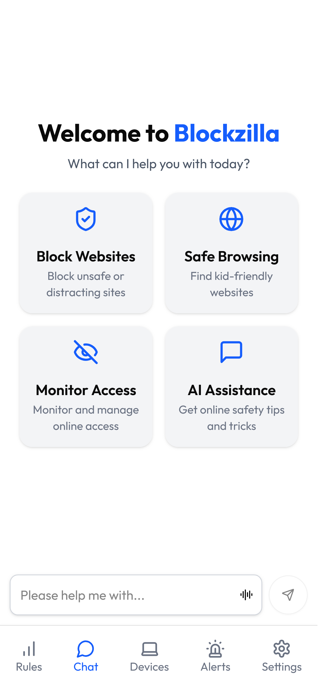
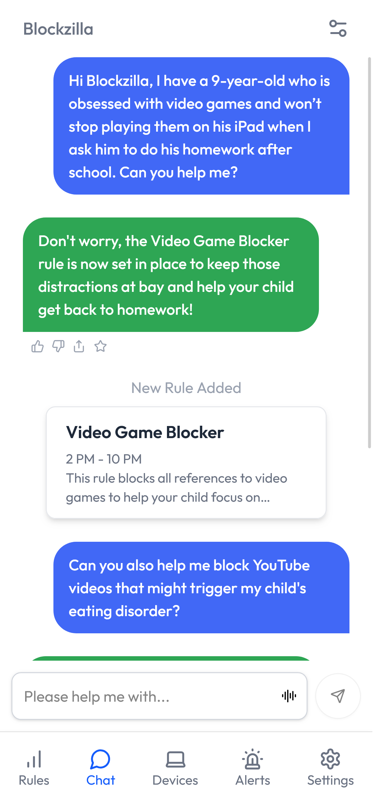
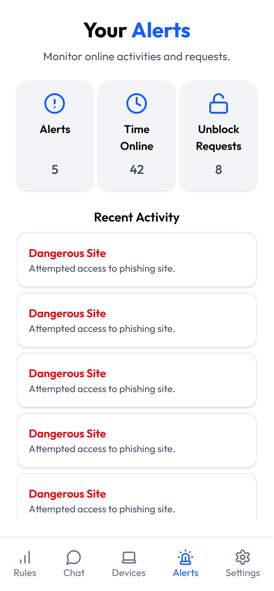
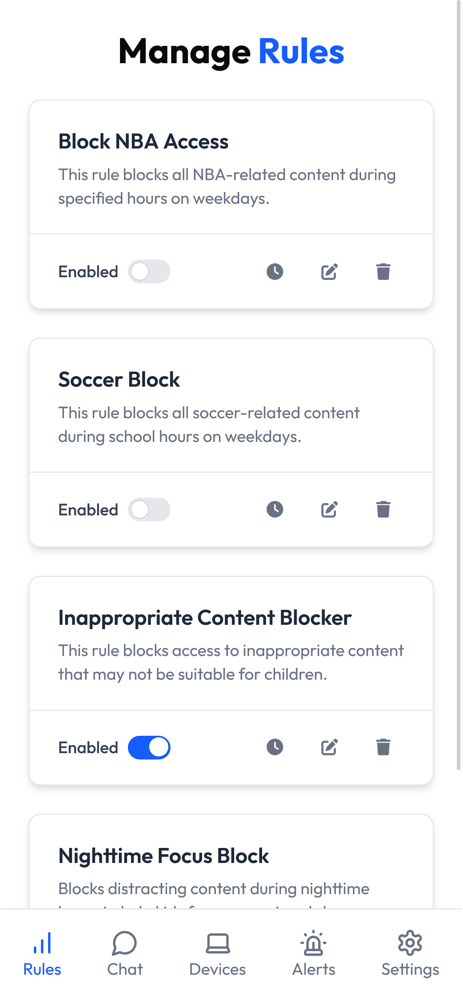
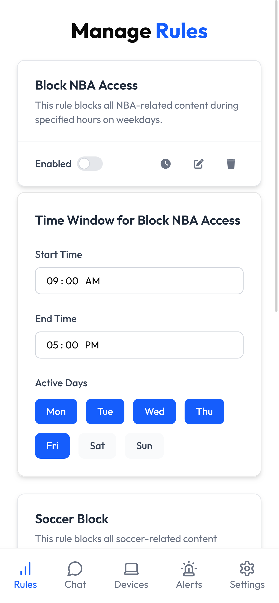
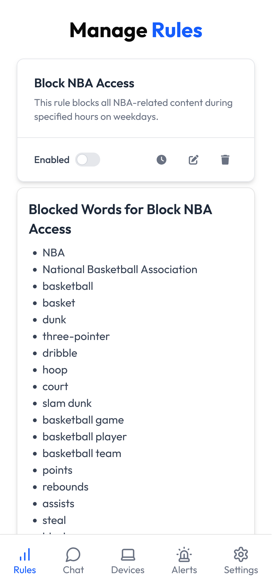

# Blockzilla

Blockzilla makes parental control as easy as natural language, like "block video games when I'm away from home."

Made for [BrickHacks 2025](https://brickhack11.devpost.com/)

## Screenshots

  
  
  
   
  
  
  

## Inspiration

The inspiration for Blockzilla came from realizing that while the internet is a rich source of information and entertainment, it can also expose children to harmful content. Traditional parental controls are often complex and intimidating for non-tech-savvy parents. We wanted to create a tool that felt as natural as having a conversation with a personal assistant—a way for parents to set boundaries using everyday language and for kids to explore safely without feeling overly restricted.

## What it does

Blockzilla transforms parental control into a seamless experience. Parents can simply tell Blockzilla things like “block posts and videos of violent video games after 8pm” or “restrict access to NBA games after 5pm,” and our system automatically enforces those rules across web browsing. The solution is a combination of a mobile app and a Chrome extension:
- **Mobile App:** Built with React.js and Firebase, it features an intuitive chatbot interface powered by OpenAI's ChatGPT API that translates natural language commands into block rules. Parents can view, modify, and remove the rules they’ve created, as well as adjust the times when the rules are in effect.
- **Chrome Extension:** Developed in JavaScript and supported by a Flask server, it leverages an AI model to assess web content in real time. It can block entire pages or, on social media sites like YouTube and Reddit, dynamically block or modify content based on the rules set by parents—ensuring that kids can explore, but not too much.

## How we built it

We integrated a diverse set of technologies to build Blockzilla:
- **Natural Language Interface:** The mobile app uses a React.js chatbot to capture parental commands and stores the resulting rules in Firebase.
- **AI-Powered Content Filtering:** A Flask server receives the rules generated by our AI model, which interprets natural language commands, and acts as a backend for the Chrome extension.
- **Dynamic Chrome Extension:** Written in JavaScript, the extension monitors and manipulates web content in real time—even on sites with lazy-loaded content. We implemented techniques like MutationObservers to detect and modify images, links, and metadata as pages load.
- **Robust Security:** We used Auth0 to handle login and user authentication, linking parent accounts with kid accounts to ensure that only parents can set what their kids see.

## Challenges we ran into

Creating Blockzilla wasn’t without its hurdles:
- **Dynamic Content:** Modern websites like YouTube and Reddit load content asynchronously, meaning images and links are rendered by JavaScript after the initial page load. We tackled this by using MutationObservers and periodic checks to ensure that all content is monitored.
- **Natural Language Processing:** Translating everyday language into precise filtering rules required careful prompt engineering of our AI model and continuous testing to ensure accuracy.
- **User Experience:** Balancing robust safety measures with a non-intrusive, user-friendly experience was a constant challenge. We had to ensure that our interventions didn’t break website functionality while still providing effective protection.

## Accomplishments that we're proud of

We’re especially proud of:
- **Seamless User Experience:** Transforming complex parental controls into simple, conversational commands.
- **Real-Time Content Filtering:** Successfully intercepting and modifying dynamically loaded content without disrupting the browsing experience.
- **Cross-Platform Harmony:** Integrating a mobile app, server-side processing, and a browser extension into one cohesive system that adapts to both parental needs and kids’ exploration.

## What we learned

Blockzilla taught us valuable lessons in:
- **AI Integration:** Understanding the challenges and rewards of using natural language processing to create intuitive systems.
- **Cross-Platform Development:** Recognizing the importance of designing solutions that work smoothly across mobile and desktop environments.
- **Real-Time Data Handling:** Implementing the Chrome extension to manage dynamic content effectively.
- **User-Centric Design:** Appreciating the critical role of simplicity and clarity in building tools that anyone can use confidently.

## What's next for Blockzilla

Looking forward, we’re excited to enhance Blockzilla further:
- **Enhanced AI Models:** Fine-tuning our natural language processing to handle a broader range of commands and contexts.
- **Expanded Platform Support:** Extending our filtering capabilities to smartphones, gaming console, and more platforms. 
- **Customizable Rules:** Allowing more granular control so parents can tailor the system even more precisely to their family’s needs.
- **User Feedback Integration:** Collaborating with educators and child safety advocates to continuously improve our approach and ensure Blockzilla meets real-world needs.
